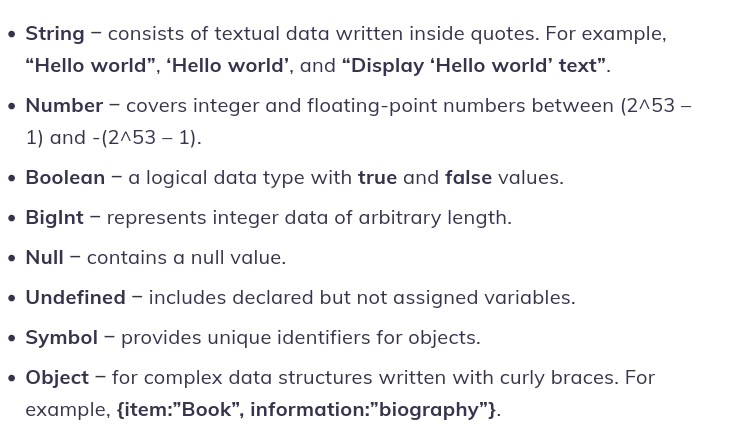
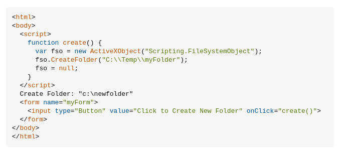
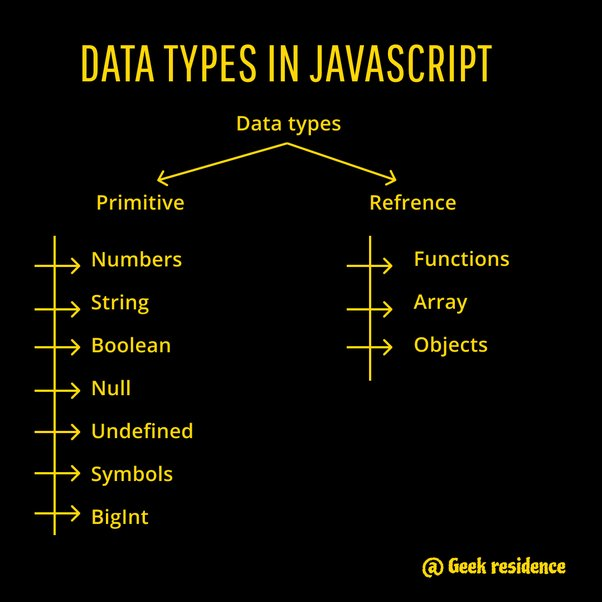
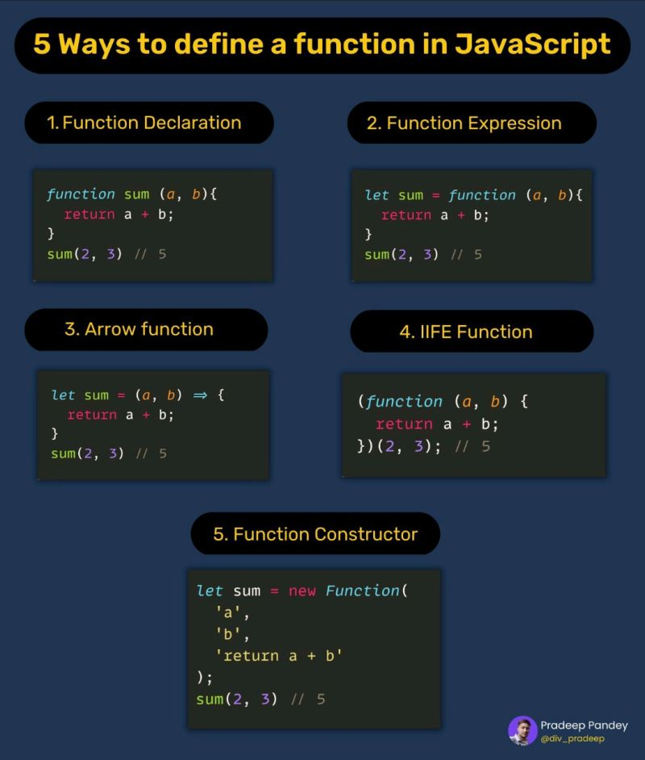
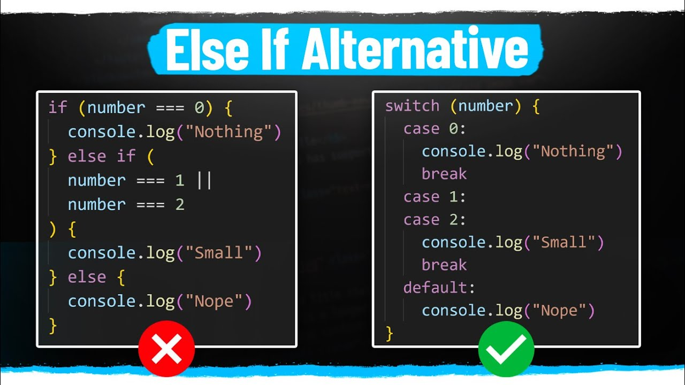

# What Is JavaScript?
#### JavaScript is a scripting language for creating dynamic web page content. It creates elements for improving site visitors’ interaction with web pages, such as dropdown menus, animated graphics, and dynamic background colors. 
```      
Не следует путать с Java.
Не следует путать с JScript.
```
#### Qualities of this language:
``` bash
JavaScript является объектно-ориентированным языком, но используемое в языке прототипирование[36][37] обуславливает отличия в работе с объектами по сравнению с традиционными класс-ориентированными языками. Кроме того, JavaScript имеет ряд свойств, присущих функциональным языкам — функции как объекты первого класса, объекты как списки, карринг, анонимные функции, замыкания[38] — что придаёт языку дополнительную гибкость.

Несмотря на схожий с Си синтаксис, JavaScript по сравнению с языком Си имеет коренные отличия:

    объекты с возможностью интроспекции;
    функции как объекты первого класса;
    автоматическое приведение типов;
    автоматическая сборка мусора;
    анонимные функции.

В языке отсутствуют такие полезные вещи[39], как:

    стандартная библиотека: в частности, отсутствует интерфейс программирования приложений по работе с файловой системой, управлению потоками ввода-вывода, базовых типов для бинарных данных;
    стандартные интерфейсы к веб-серверам и базам данных;
    система управления пакетами[~ 2], которая бы отслеживала зависимости и автоматически устанавливала их.
```
# JavaScript was invented by Brendan Eich in 1995. It was developed for Netscape 2, and became the ECMA-262 standard in 1997.

# JS is has EcmaSript into it where developers can solve their updates of this language but they never delete something in it like (Nall, Var and o.th) mistaces that were done on this language but still people are using it
____________
#### ++ (инкремент), -- (декремент), - (унарный минус), + (унарный плюс), ^ (поразрядное дополнение), ! (логическое дополнение), delete (удаление свойства), typeof (определение примитивного типа данных), void (возврат неопределённого значения),
#### * (умножение), / (деление), % (остаток от деления),
#### + (сложение), - (вычитание), + (конкатенация строк),
#### << (сдвиг влево), >> (сдвиг вправо с расширением знакового разряда), >>> (сдвиг вправо с дополнением нулями),
#### < (меньше), <= (меньше или равно), > (больше), >= (больше или равно), instanceof (проверка типа объекта), in (проверка наличия свойства),
#### == (проверка на равенство), != (проверка на неравенство), === (проверка на идентичность), !== (проверка на неидентичность),
#### & (поразрядная конъюнкция),
#### ^ (поразрядное сложение по модулю 2),| (поразрядная дизъюнкция),
#### && (конъюнкция),
#### || (дизъюнкция),
#### ?: (тернарная условная операция),
#### = (присваивание), *=, /=, +=, -=, <<=, >>=, >>>=, &=, ^=, |= (присваивание с операцией),, (множественное вычисление).
#### Операторы ++, --, -, +, ~, !, delete, typeof, void, ?:, =, *=, /=, +=, -=, <<=, >=, >>>=, &=, ^=, |= правоассоциативны (то есть для них a op b op c эквивалентно a op (b op c)). Остальные операторы ECMAScript левоассоциативны[22].

```
По арности операторы ECMAScript делятся на следующие группы:
```


#### унарные (delete, void, typeof, ++, --, - (унарный минус), + (унарный плюс), ^, !, new)[Спецификация 16],
#### бинарные (., [], (), *, /, %, + (сложение), - (вычитание), + (конкатенация строк), <<, >>, >>>, <, <=, >, >=, instanceof, in, ==, !=, ===, !==, &, ^, |, &&, ||, =, *=, /=, +=, -=, <<=, >=, >>>=, &=, ^=, |=, ,),
#### тернарные (?:)
#### операторы, не имеющие фиксированного количества операндов (()).

#### По положению знака операции относительно операндов операторы ECMAScript делятся на следующие группы:префиксные (например, new, ++ (префиксный инкремент),инфиксные (например, +, -),постфиксные (например, ++ (постфиксный инкремент), -- (постфиксный декремент).



#### here are some examples of creating js folder in your pc
## 1: you can create it by using your terminal 
## 2:you can create it by using your browser
## 3:you can use your VS Code (i mean your editor) to open it by using tool Code runder or by writing node.js

#### JavaScript uses data types to categorize the different kinds of information it can store and work with. These data types determine how the data is used in calculations and expressions.
#### Here are some of the fundamental data types in JavaScript:
``` diff
+Number: This data type represents numeric values, including integers (whole numbers) and decimals. For example, 42 and 3.14159.
+String: This data type represents sequences of characters, used for text. Strings are enclosed in quotes (either single or double). Examples include "hello, world!" and 'This is a string'.
+Boolean: This data type represents logical values: true or false. Booleans are often used in conditional statements to control program flow.
```
#### JavaScript also has some special data types:
``` diff
-Null: This represents the intentional absence of a value. It's useful for indicating that a variable doesn't point to any data.
-Undefined: This indicates that a variable has been declared but hasn't been assigned a value yet.
-Object: This is a complex data type that allows you to store collections of key-value pairs. Objects are fundamental for building more complex data structures in JavaScript.

```
#### There are additional data types that you might encounter as you learn more about JavaScript, such as Symbol and BigInt.

 
#### In JavaScript, functions are powerful tools that let you create reusable blocks of code. There are two main ways to define functions: function declarations and function expressions. Additionally, there's a way to run a function immediately after it's created, called an Immediately Invoked Function Expression (IIFE).
## First one is Function Declarations:
__________
### Definition: These are defined using the function keyword followed by a name and parentheses *()*. Optionally, you can specify parameters within the parentheses. The function body is enclosed in curly braces *{}*.
>Hoisting: A unique aspect of function declarations is hoisting. They are treated like they are declared at the top of their scope (usually the entire script), even if they appear later in the code. This means you can call a function before it's defined in the code.
#### Here are some examples
``` bash
function greet(name) {
  console.log("Hello, " + name + "!");
}
greet("Bob"); // This works because of hoisting but (i fail and maybe teacher should say that i must delete it because we still dont know about hoisting sorry again)
```
## Function Expressions:
#### Definition: These are assigned to a variable like any other value. They are defined using the function keyword, but unlike declarations, they don't have a name on their own. They can have optional parameters and a function body within curly braces.
#### No hoisting: Function expressions cannot be called before they are defined.
>And yeah i want to share with some information that Function expression has got 2 types of Arrow Function and Anonymous Function
#### An anonymous function is a function that is defined without a name. Instead, it is usually assigned to a variable or passed as an argument to another function. Here's an example of an anonymous function in JavaScript:
``` bash
let add = function(x, y) {
    return x + y;
};
```
>Arrow functions, on the other hand, are a more concise way to write anonymous functions in JavaScript. They were introduced in ECMAScript 6 (ES6). Here's how you can rewrite the previous example using an arrow function:
``` bash
let add = (x, y) => {
    return x + y;
};
```
## IIFE Immediately Invoked Function Expression
#### IIFE stands for Immediately Invoked Function Expression. It's a design pattern in JavaScript where a function is defined and executed immediately after being created. This pattern is often used to create a new scope and to prevent pollution of the global namespace.
>~~Remember if you created this function YOU MUST IMEDIATLY CALL IT~~
``` bash
(function(x, y) {
    console.log(x + y);
})(10, 20); // Output: 30
```



__________________________

#### In JS we have got 3 tipes of condition making 
>if...else Statements,Switch...Case Statements and Ternary Operator (? :)
### if...else Statements:
#### here are some examples
``` bash
let x = 10;

if (x > 5) {
    console.log("x is greater than 5");
} else {
    console.log("x is not greater than 5");
}
```
### Switch...Case Statements:
`The switch statement evaluates an expression, matching the expression's value to a case clause, and executes the statements associated with that case. It's useful when you have multiple conditions to check against a single value.`
``` bash
let day = "Monday";

switch (day) {
    case "Monday":
        console.log("It's Monday!");
        break;
    case "Tuesday":
        console.log("It's Tuesday!");
        break;
    default:
        console.log("It's some other day.");
}
```
### Ternary Operator (? :)
``` bash
let age = 20;
let message = (age>=18) ? "You are an adult" : "You are not an adult";
console.log(message);
```


>about for in js `sorry that i forget to give some information about ~~FOR~~`
#### here is the structure of this for
``` bash
for (initialization; condition; increment/decrement) {
    // code to be executed and yeah it is not a code it is just a structure
}
```
``` bash
for (let i = 0; i < 5; i++) {
    console.log(i);
}
```
#### Done By Anisajon